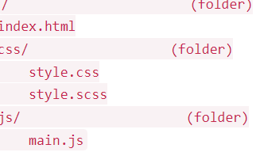

# WebsiteW_SearchEngine

School project to learn how to use APIs and create a website with a search engine.

Giphy Key: dSmFYQr7C2aHEpofDQQH7549iX1zzKSi

Workflow Requirements
This project requires a bit more work with APIs than was directly covered in the material. You are encouraged to watch the following video that walks through the process of using jQuery/Ajax to request data from and API, and display images on screen.

Helpful, relevant video walk-through

The following requirements are related to how you go about building your project

The planning phase should be completed prior to beginning the development phase and/or touching any code.

Wireframes can be done on paper or using any number of widely available applications. A free one that may be useful is draw.io.

Planning phase

1. Create at least 3 user stories
2. Create wireframes for desktop and mobile views

Development phase

3. Create a GitHub repository on Github.com (before you start coding)
4. Clone it to your local machine (before you start coding)
5. You will need to obtain an API key through Giphy
6. Review the documentation for the "Search Endpoint"
7. Make frequent commits throughout your development that are descriptive, such as "adds todos reducer" (throughout development/coding process)

Scenario
This project will require you to sharpen your CSS and JavaScript expertise, alongside your proficiency in conducting research beyond the scope of what's already been covered—an essential skill for developers in their regular practice.

The goal of this project is to build out your own Giphy search engine that:

allows users to enter and submit a keyword
makes a request to the Giphy api based on that keyword
receives and parses the response
displays images on the page from that response
uses a custom css grid to display the images
ensures the site is responsive so that it looks good/works well on both desktop and mobile devices

Alternatively, you can create any JavaScript projects using a different API assuming that the functionality of your project is comparable to the Giphy example. If you choose to implement a custom project, make sure to find an API that resonates with you and make it possible to search its contents via a form on your website.

Technical Requirements
The following requirements are related to what your code should contain

1. Your site only needs to contain one HTML page, but there should still be multiple links in your menu (even if they don't link to other pages)
2. There should be an input field (with a type of search) & a submit button
3. A user should be able to type in a search phrase, click submit, and your site should query the Giphy API based on the search expression that your users enter
4. Iterate through the returned data, and for each returned object in the array, find an image in the returned JSON and append that image to the screen
5. Your project should contain three files: index.html , style.scss , style.css and main.js and your project directory structure should look like picture below

Design

6. Your styling should all be done in your style.scss file (SASS), and you should use a CSS Preprocessor to watch that file for changes and output it to your style.css file. (Optional – for extra points. A solution with a simple CSS file is also accepted)

Site-wide 7) Choose a Google Font that you've never heard of before and use that to style your site title
Here is a helpful video!

Desktop

8. Use flex to ensure your site's name and nav bar appear aligned to the sides of the header (like in the screenshot below)
9. Use flex; to ensure your input field and submit button appear side by side
10. Create your own custom grid classes in css, that make use of the flex property, and leverage these in your code so that the images appear in rows and columns

Mobile (320px and below)

Use a @media query to ensure that:

11. Your site title and navbar stack vertically
12. Your navigation items stack vertically
13. Your images stack vertically in a single column

visual asset

Deliverables

1. Your user stories
2. A collection of wireframes - one for each view of your app
3. Your app source code should be available for viewing in your GitHub repository
4. A readme.md file in the root project folder that contains the following information about your project:

Your name
Overview/description of the project
Details on how to use it or what functionality is offered
Technologies Used ( .html , .css )
Ideas for future improvement (minimum of 3)

5. Your repository should contain at least 15 commits and should reflect a consistent commit history

6. Your code should be hosted on GitHub Pages.

Submit your GitHub link and hosting link (include everything on a word document and upload the document in the Project Submission section). All deliverables should be included on GitHub and the site should be made publicly available using a hosting service.

Please note, similarly to the first project, you will be evaluated on your ability to meet both the workflow requirements and the technical requirements .

Project Grading
In order to pass the project, Instructor will take below criteria into consideration while grading your project so please make sure you have covered everything mentioned below to successfully pass the project grading.

Functionality
Robustness
Creativity, styling, user experience
Code quality.
GitHub structure
Documentation, Installation instructions, Comments
